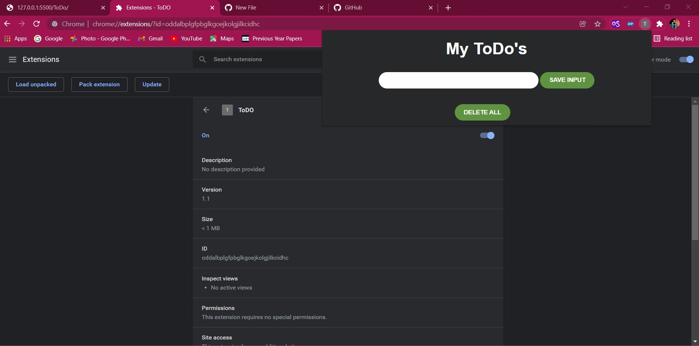
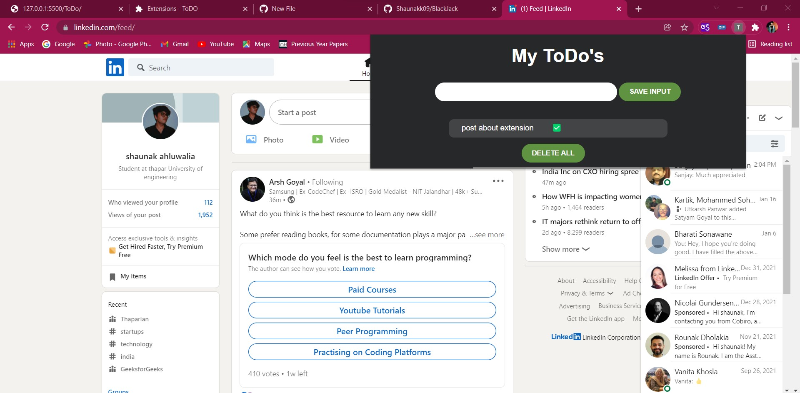
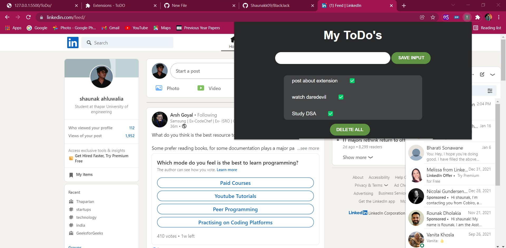
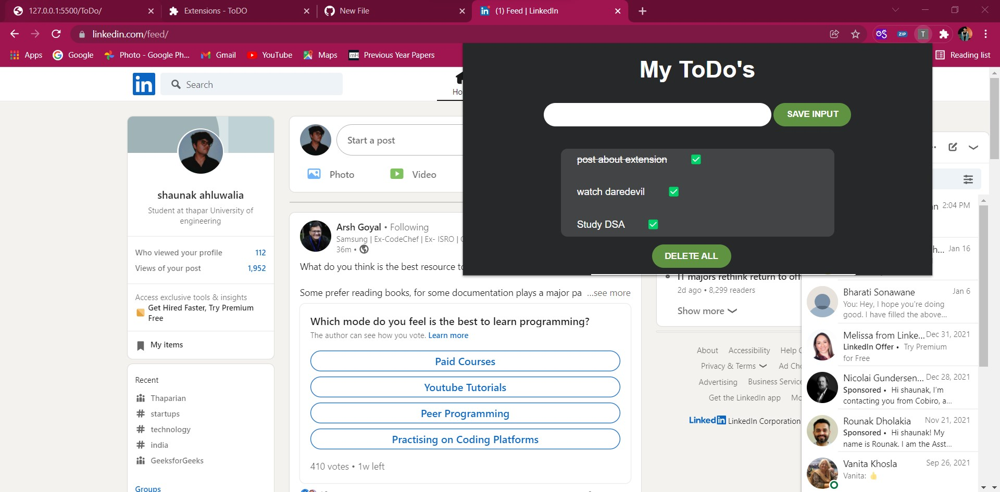
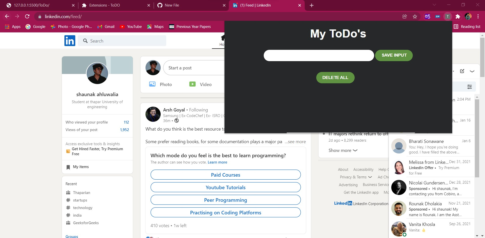

# ToDO_extension
Hi, I have made a simple ToDo chrome extension using html,css,js and manifest.json.
To make the information stay on the extension, I have used local storage system in javascript to add and delete new ToDo's.

On clicking on the tick mark , the ToDO becomes marked as complete.

On double clicking on delete all ,you can start your new ToDo's on a new day.

